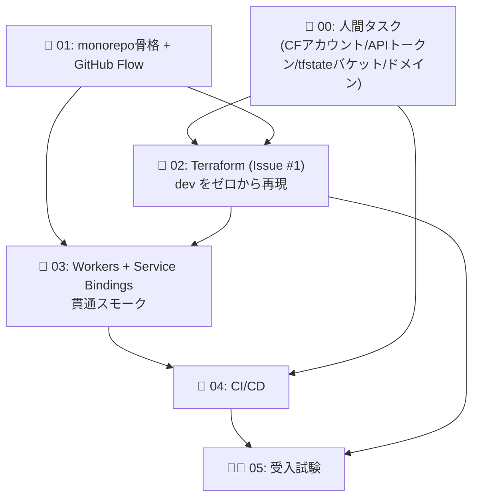

# M0：開発基盤 — 作業手順書

> 出典：企画書 v3.1 11章（技術基盤）／21章（開発体制）／22章（ロードマップ M0）。企画書は**非公開リポジトリ** `Kewton/Musubi-workspace` の `proposal/` にある
> 対象リポジトリ：`github.com/Kewton/Musubi`（= 企画書21章の `musubi` monorepo）
> 目安期間：**2週間（10営業日）**

---

## 0. このディレクトリの読み方

| ファイル | 内容 | 主担当 |
|---|---|---|
| `README.md`（本書） | M0全体像・DoD対応表・依存関係・スケジュール | — |
| [`00-human-tasks.md`](./00-human-tasks.md) | **初期設定・判断タスク**（先行必須。実測状況は [`00e`](./00e-execution-status.md)） | **AI代行＋本人の判断・認証** |
| [`01-repo-bootstrap.md`](./01-repo-bootstrap.md) | monorepo骨格・GitHub Flow・Issueドリブン | AI＋一部人間 |
| [`02-terraform.md`](./02-terraform.md) | Terraform（アカウント単位資源）／**最初のIssue [#2](https://github.com/Kewton/Musubi/issues/2)** | AI |
| [`03-workers-and-bindings.md`](./03-workers-and-bindings.md) | wrangler.jsonc・host/gateway/data-api・Service Bindings・貫通スモーク | AI |
| [`04-cicd.md`](./04-cicd.md) | GitHub Actions（PR検査／staging自動／tag→prod／ロールバック） | AI＋一部人間 |
| [`05-acceptance.md`](./05-acceptance.md) | M0受入試験（DoD判定手順） | AI＋人間承認 |
| [`06-plan-and-limits.md`](./06-plan-and-limits.md) | **課金プラン・無償枠・昇格トリガーの正本（M0は $0）** | AI＋人間承認 |
| [`07-parallel-plan.md`](./07-parallel-plan.md) | **Issue #2〜#28 の並列実行計画**（レーン・波・ファイル衝突・クリティカルパス） | AI（別エージェントへの引き継ぎ用） |
| [`issues.md`](./issues.md) | 起票するIssue一覧（Milestone `M0`・依存順） | AI（起票代行可） |
| [`checklist.md`](./checklist.md) | 一枚もの進捗チェックリスト | 共用 |

### 凡例（担当区分）

| マーク | 意味 |
|---|---|
| 🧑 | 本人の判断・認証が必要な箇所を含む。設定操作はAIが代行できる場合がある（`00` 参照） |
| 🧑🤖 | AIが下準備／コマンドまで用意するが、**実行または承認に人間の権限が要る** |
| 🤖 | AI（Claude Code）が単独で完遂できる |

---

## 1. M0のゴール（企画書22章のDoD）

| # | 項目 | 完了条件（DoD） | 本書の対応 |
|---|---|---|---|
| M0-1 | ブランチ戦略＋Issueドリブン | GitHub Flow運用開始・Milestone紐付け（21章） | `01` / `issues.md` |
| M0-2 | CIパイプライン | PR検査＋staging/prod自動デプロイが通る | `04` |
| M0-3 | Cloudflare IaC化 | wrangler.jsonc＋Terraformの二層で、dev/staging/prodを**手作業ゼロで再現** | `02` / `03` |
| M0-4 | メインアプリのデプロイ確立 | host＋gateway＋data-apiがCIからstaging/prodへ。**Service Bindings結線** | `03` / `04` |

**M0で作らないもの**（意図的スコープ外・M1以降）
- ミニアプリの生成・配信（Form A経路・R2 bundle動的ロード）→ **M1**
- CommandAgent連携（headless契約の疎通・ピン差し替えの儀式）→ **M1**
- 認証（Google OAuth。LINE Login は軌道に乗り要望が出てから）・ゲストclaim・招待リンク・Instant Runtime → **M2**
- Connector Plane / Turnstile本運用 / Stripe → M4以降

> M0は「**中身が空でも、3環境が手作業ゼロで再現でき、CIから配れて、Service Bindingsが端から端まで結線されている**」ことだけを証明する回。機能を足したくなったらIssueにしてM1へ送る。

---

## 2. 依存関係

**実環境への適用のクリティカルパス＝ `00`**。Cloudflare アカウント／API トークン／tfstate 用 R2 バケットが必要。これらの設定操作はAIが代行でき、ローカルでの設計・実装準備は並走できる。R2の利用申込みなど未確定の判断と本人認証は個別に扱う。

---

## 3. 2週間スケジュール（目安）

| 日 | 内容 | 担当 |
|---|---|---|
| D1 | 🧑 `00-human-tasks.md` の **H-01〜H-04, H-07, H-08, H-13** を一気に片付ける（H-06・H-14 は 2026-09-12 決定済み）（ここが律速） | 人間 |
| D1–D2 | `01` monorepo骨格・pnpm workspace・tsconfig references・Issue/Milestone起票 | AI |
| D3–D5 | `02` Terraform モジュール化・**dev をゼロから再現（Issue #1 クローズ）** | AI |
| D5–D7 | `03` host/gateway/data-api 骨格・wrangler二層・Service Bindings・貫通スモーク（dev） | AI |
| D8–D9 | `04` GitHub Actions（PR検査／main→staging／tag→prod）・D1マイグレーション・ロールバック手順 | AI |
| D9 | 🧑 staging/prod 環境の Terraform apply 承認・Environments reviewer 設定 | 人間 |
| D10 | `05` 受入試験（destroy→apply→deploy→smoke の再現性計測）・M0クローズ判定 | 共用 |

並走レーン（M0中も止めない・企画書22章）
- CommandAgent 回帰スイートCI監視 … 既存のまま（本リポジトリでは触らない）
- 🧑 商標クリアランス（9類・42類）調査の発注 … D1に発注、結果はM4公開前までに（`00` H-05）

---

## 4. アーキテクチャ上の確定事項（M0で守る不変条件）

企画書から M0 の実装判断に効くものだけを再掲する。**逸脱する場合はIssueで理由を残すこと。**

1. **IaC二層**（11章）：`wrangler.jsonc` ＝ サービス単位の正本／`Terraform` ＝ アカウント単位資源（D1・R2・WfP namespace・DNS・Turnstile）。**この線を越えない。**
2. **3環境**（11章）：`dev`（wrangler dev = workerd でローカル9割再現）／`staging`（WfP dispatchの穴・ピン差し替えの検証場）／`production`。
3. **リクエスト経路はTypeScript一択**（9章）。M0で作るWorkerはすべてTS。
4. **Data APIが唯一の権限強制点**（9章）。M0では権限を実装しないが、**gateway が D1/R2/DO に直接触らない**構造だけは最初から守る（触れるのは data-api のみ）。
5. **1アプリインスタンス＝1 Durable Object（SQLite付き）／D1はControl Plane専用**（9章）。M0のDOは health probe だけだが、SQLite migration を最初から `new_sqlite_classes` で切る。
6. **Cloudflareに載せないもの**（11章）：Builder Plane・LLM API・Google OAuth のクライアント設定・EXT-2メール送信・Stripe。M0のTerraformにこれらを入れない。
7. **Platform固有機能への依存はAdapter層に閉じ込める**（11章）。M0では `packages/*` から `cloudflare:workers` を直接importするのは `app-do` のみに限定する。
8. **無償プラン前提**（→ [`06`](./06-plan-and-limits.md)）：**M0は Cloudflare Free で $0**。これが2つの設計を確定させる——
   - **host は SSR ではなく SPAシェル＋Static Assets**（CPU 10ms/リクエスト制約。招待制でSEO不要という企画書11章の前提が、そのまま無償枠適合の根拠になる）
   - **Workers for Platforms を使わない**（企画書12章「L1-L2ではコードを1行も生成しない」により MVP 3アプリは WfP 不要。R2の超過時課金は別途 `06` 参照）
   - ただし**アーキテクチャを課金プランに売らない**。CPUが足りなければ gateway と data-api を統合するのではなく、$5 払って昇格する（企画書9章「Data APIが唯一の権限強制点」を崩さない）

---

## 5. M0の「事前宣言」（企画書16章の型を基盤側にも適用）

技術側で確立した「事前宣言→実測→清算」を M0 にも適用する。**着手前に以下の線を宣言し、`05-acceptance.md` で清算する。**

| 指標 | 事前宣言する線 | 測り方 |
|---|---|---|
| dev環境の再現時間 | **≤ 15分**（destroy → apply → sync → deploy → smoke） | `05` の再現試験をストップウォッチ計測 |
| 再現の手作業回数 | **0回**（コマンド列のみ。ダッシュボード操作ゼロ） | 同上・操作ログ |
| PR検査のCI時間 | **≤ 5分**（lint＋typecheck＋unit） | Actions実行時間 |
| main→staging反映 | **≤ 10分**（merge から smoke green まで） | Actions実行時間 |
| 月額インフラ費（M0時点） | **$0**（2026-09-12 宣言。Workers Free＋R2無料枠＋GitHub public。**唯一の課金経路は R2 の無料枠超過**） | 毎週月曜の週次チェック（`06` §5.1）と初月の請求 |
| 観測された最大CPU時間 | **< 10ms**（Free の上限。余裕を記録する） | スモークで計測（`06` §7 要確認#1） |
| 日次リクエスト | **< 50,000/日**（上限100kの50%） | Workers Analytics |

> 線を外した項目は「未達」として `05` に記録し、M1に持ち越すか設計を直すかを明示的に決める。**黙って通さない。**

---

## 6. このリポジトリの現状（着手時点で確認済み）

| 項目 | 状態 | 備考 |
|---|---|---|
| `github.com/Kewton/Musubi` | 存在・**空**（コミット0） | `main` ブランチも未作成 |
| 可視性 | **PUBLIC** | 🧑 **要判断**（`00` H-06）。公開のままか private 化か |
| ローカル | `workspace/` のみ（未コミット） | 企画・計画ドキュメント置き場 |
| `gh` CLI | v2.86 / `Kewton` で認証済み・scopes: `repo`,`workflow`,`read:org`,`gist` | branch protection・Environments・Secrets を CLI で設定可能 |
| Node / pnpm | v24.1.0 / v10.13.1 | 要件を満たす |
| terraform | **未インストール** | `01` で `tfenv` 導入・バージョン固定 |
| Cloudflareプラン | **Workers Free＋R2無料枠で開始する案** | Workers / WfP の有償化はトリガー駆動（`06` §5）。R2は別途利用申込み・超過時課金の判断が必要 |
| wrangler | 未インストール | monorepo の devDependency として導入（グローバル入れない） |

---

## 7. M0 完了の判定

`05-acceptance.md` の受入試験を全項目パスし、以下を満たしたら M0 クローズ。

- [ ] M0-1〜M0-4 の DoD がすべて green
- [ ] §5 の事前宣言7項目を実測し、清算表に記録した（未達があれば処置を明記）。**課金額が $0 であることを含む**
- [ ] Milestone `M0` の Issue がすべて closed（持ち越しは `M1` に付け替え）
- [ ] `docs/runbook/rollback.md` が存在し、**実際に1回ロールバックを実演した記録がある**

→ 判定後、直ちに **M1（垂直スライス「工場→店頭」）** へ。M1のゲートは「封緘済みgolden割り勘がstagingのスマホで動く」。
