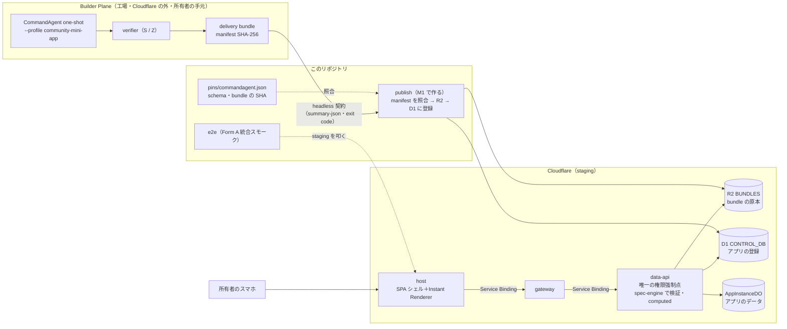

# M1：垂直スライス「工場→店頭」 — 概要

> 出典：企画書 v3.2 の 8章（表現力ラダー）／9章（アーキテクチャ）／12章（Builder Plane）／13章（テンプレート契約）／21章（リポジトリ構成）／22章（ロードマップ M1）。
> 企画書は非公開リポジトリ `Kewton/Musunest-workspace` の `proposal/` にある。**ここには章番号だけを書き、内容を引き写さない。**
> 状態：**未着手**（2026-09-15 時点。M0 は 2026-09-15 にクローズ）。本書は Issue を切り出す前の整理であり、手順書ではない。
> 着手前に所有者が決めることは [`00-open-questions.md`](./00-open-questions.md) にまとめた。

---

## 0. 一言でいうと

**CommandAgent（工場）が作って検証した割り勘アプリの納品物を、MUSUNEST（店頭）が R2 から読み込み、staging のスマホで実際に使える状態にする。**
あわせて、工場と店頭のあいだの接点（headless 契約とピン）を、プラットフォーム側から一通り動かす。

M0 は「空の店舗」を作った（host → gateway → data-api → D1 / R2 / DO が3環境で動く）。M1 はそこに**最初の商品を1つ並べる**。
ログイン・Community・招待・リアルタイム同期は M2 の仕事で、M1 では作らない（§6）。

| | M0（完了） | M1（これから） | M2 |
|---|---|---|---|
| 動くもの | `/healthz` の貫通スモーク | **封緘済み golden 割り勘が1つ動く** | 自分たちで作って共有して使う（TTSU ≤10分） |
| 使う人 | CI | 所有者のスマホ（ログインなし） | 招待されたメンバー（ゲスト claim・Google OAuth） |
| 工場との接点 | ピンを書いただけ | **ピンで読んで、再検証まで回す** | Queue から自動で生成を起動する（連携 Lv2） |

---

## 1. ゴール

### 1.1 完了条件（企画書22章 M1 を、このリポジトリの言葉で言い直したもの）

| # | 項目 | 完了条件 |
|---|---|---|
| M1-1 | ミニアプリを配れる | R2 に置いた納品物（bundle）を host が実行時に読み込み、アプリのデータが Durable Object に保存される経路が通る。**封緘済み golden 割り勘が staging のスマホで動く** |
| M1-2 | CommandAgent 連携 Lv1 | ① headless 契約で工場の結果を読める ② ピン差し替えの儀式を1回行う ③ one-shot の生成 → R2 → スマホまでを一気通貫で通す ④ 納品物の決定的な再検証をプラットフォーム側から再現する |

### 1.2 ゲート（2026-09-15 に事前宣言済み・`../m0/05-acceptance.md` §7）

「封緘済み golden 割り勘が staging のスマホで動く」。判定者は Kewton、期限は M1 着手から 2 週間（着手日は未記入）。判定方法は5項目：

1. 手持ちのスマホ1台で staging の URL を開く（OS とブラウザを記録）
2. 封緘済み golden の割り勘を起動する
3. golden のシナリオどおりに入力し、**結果が golden の期待値と一致する**
4. 再読み込みしても、別の端末で開いても、データが残っている（DO に保存されている）
5. 配った bundle の SHA-256 が `pins/` の値と一致することを、機械（smoke か e2e）で確かめる

> ⚠️ **3 の「期待値」がまだ定義できていない**（§2.3）。着手前に決める（`00` の Q2）。

---

## 2. 何を動かすのか：封緘済み golden 割り勘の実体

### 2.1 納品物（bundle）

CommandAgent（`pins/commandagent.json` の revision `031ec74`。2026-09-15 時点の main と同じ）には、割り勘の **L2 の納品物が1つ、R2 に置く形のまま封緘されている**。

| 項目 | 値 |
|---|---|
| 場所 | `workspace/management/runs/cm4-delivery-bundle-001/bundle/`（CommandAgent） |
| 形式 | `commandagent.community-delivery-bundle/v1`（`bundle-manifest.json` が 11 ファイルの SHA-256 とサイズを列挙する） |
| 由来 | 封緘済みスイート `community-golden-warikan`（要求文3種。`community-golden.sha256sums` で封緘）の1回の生成。修復 0 回 |
| 成果物の段 | **L2**（`app.spec.yaml` だけ。`app-zone/` のコードは無い） |
| 検証 | S（spec）pass・Z（境界）pass・B（ビルドとスモーク）は L2 なので対象外。再検証を2回行って同じ bytes・同じ verdict |
| headless の要約 | `verdict: full`、**`assurance: partial`** |
| スキーマ | `community.app-spec/v0.1`。SHA-256 は `pins/commandagent.json` の `appspec_schema.sha256` と**一致**（`80e4cb41…`） |
| manifest の SHA-256 | `9e0865ea86a35070d7f3e6b87d615aaf2ac6c9f80aec7cb5958b2c6ed8eefdb8` |

`assurance: partial` は隠し事ではなく、CommandAgent の契約どおりの正直なラベルである——**L2 の「full」は「spec は検証済み。実行時のスモークはプラットフォーム統合が受け持つ」という意味**で、工場は画面で動かしていない。
**M1 はまさにその「プラットフォーム統合側の被覆」を埋める**マイルストーンである。

### 2.2 アプリの中身（`artifacts/app.spec.yaml`）

```yaml
entities:
  - name: expense
    fields: { amount: number, payer: string, participants: list, description: string }
views:       [{ name: expenseList, entity: expense }]
actions:     [{ name: addExpense, entity: expense }]
validations: [{ name: positiveAmount, entity: expense, expression: amount > 0 }]
computed:
  - { name: shareAmount,      entity: expense, expression: amount / len(participants), type: number }
  - { name: netBalance,       entity: expense, expression: amount - shareAmount,       type: number }
  - { name: settlementAmount, entity: expense, expression: max(0, netBalance),         type: number }
permissions: [{ name: read, subject: minIdentity }]
minIdentity: { mode: anonymous }
```

（原本はブロック形式の YAML。ここでは読みやすさのためにフロー形式へ畳んだ。バイト列の正本は CommandAgent 側）

つまり、**支出を1件ずつ登録し、1件ごとに「一人あたりの額」「立て替えた人が受け取る額」を出す**アプリである。

### 2.3 スキーマ v0.1 で表現できること・できないこと

v0.1 は小さい（355 バイト）。computed は**同じ entity の中だけ**を参照でき（`reference_scope: same_entity`）、全体への参照は QUEUED（未解禁）。登録関数は `min`・`max`・`len` だけ。

| 表現できる | 表現できない（v0.1 では） |
|---|---|
| 支出1件ごとの一人あたりの額・立て替え分 | 人ごとの収支の合計（支出をまたぐ集計） |
| 入力の検証（`amount > 0`） | 「誰が誰へいくら渡すか」の精算（全体参照と精算の標準関数が要る） |
| 一覧の表示・支出の追加 | メンバーという entity・entity 間の関連 |

企画書8章の割り勘の例（全体の収支から精算を出す形）は、**封緘済みの v0.1 では書けない**。golden の生成も v0.1 の範囲で書かれている。
そのため、ゲートの判定 3 の「golden の期待値」を「誰が誰へいくら」と読むと、M1 では満たせない。**スキーマの拡張（v0.2）と golden の再封緘は工場側の裁定が要り、M1 の2週間には入らない**見込みである（`00` の Q2）。

### 2.4 v0.1 が決めていない「実行時の意味」

スキーマは宣言の形を決めるが、**動かしたときの意味の多くは決めていない**。スキーマは platform-owned（MUSUNEST が正本）なので、M1 でプラットフォームが決める（スキーマのバイト列は変えない）。

| 宣言 | 決めていないこと | 例 |
|---|---|---|
| `fields` の型 | `list` の要素の型・入力の仕方 | `participants` は名前の文字列の並びか。立て替えた人自身を含むか |
| `views` | 表示の種類（一覧・集計…） | `expenseList` は一覧でよいか。computed をどこに出すか |
| `actions` | 何をする操作か（追加・更新・削除） | `addExpense` は1件の追加だけか |
| `permissions` / `minIdentity` | `subject: minIdentity`・`mode: anonymous` の強制の仕方 | M1 はログインが無いので、誰でも読み書きできる状態になる（§7.3） |

---

## 3. 全体像



### 3.1 リクエストの流れ（M1 で通す道）

1. **配る**：手元の publish が、bundle の manifest（全ファイルの SHA-256・余分なファイルが無いこと）と `pins/` を照合してから、R2 に原本を置き、D1 に「このアプリ（bundle の SHA）・このインスタンス」を登録する
2. **開く**：スマホが host の `/apps/<インスタンス>` を開く。ページは SPA シェル（Static Assets）が返す——**SSR にしない**
3. **読む**：画面が `/api/...` を呼ぶ。host の Worker が gateway へ中継し、data-api が D1 の登録から R2 の spec を引いて返す（host・gateway は R2 に触れない）
4. **書く**：「支出を追加」は data-api が spec の `validations` で検証してから DO に保存する。computed は data-api が spec-engine で評価して返す
5. **残る**：再読み込み・別の端末でも、同じインスタンスの DO から同じデータが返る

---

## 4. M0 から引き継ぐもの・M1 で足すもの

| 部品 | M0 の状態 | M1 で要るもの |
|---|---|---|
| `packages/appspec-schema` | 空（`APPSPEC_SCHEMA_VERSION = "0.0.0-m0"`） | v0.1 のスキーマのバイト列を正本として持つ（SHA がピンと一致）。型・§2.4 の実行時の意味の定義 |
| `packages/spec-engine` | 空 | computed の評価（閉じた式・AST の深さ 12・ノード 64・同じ entity の中・トポロジカル順）と validations の評価。**評価の前に静的に検査する** |
| `packages/app-do` | `kv` 表だけ（healthz 用） | entity のレコードを持つ表。インスタンスごとに1つの DO（クラス名 `AppInstanceDO` は変えない） |
| `packages/control-plane` | `_musunest_meta` の表だけ | アプリ（bundle）とインスタンスの登録の表（D1 の migration。前方互換の規律どおり） |
| `packages/data-api` | `/healthz` だけ | spec を返す・レコードの一覧と追加（検証つき）・computed を返す API。R2 から spec を読む |
| `apps/gateway` | `/healthz` の中継 | `/api/...` の中継（M1 は認可なし。M2 で AppGrant の検査が入る） |
| `apps/host` | `/api/*` は 404 を返すだけ | `/api/*` を gateway へ中継する。**Instant Renderer**（spec から一覧・入力フォーム・computed の表示を作る画面） |
| `packages/sdk` | 空 | 画面から data-api を呼ぶ型付きの入口（host が使ってよいのは sdk だけ） |
| `e2e` | 空 | Form A 統合スモーク：publish → インスタンス作成 → 追加 → computed・永続化・bundle の SHA を照合 |
| `pins/commandagent.json` | schema・headless の版は確定。テンプレの tarball は null（#38） | golden の bundle のピン（manifest の SHA-256） |
| `templates/tanstack-start` | README だけ | L2 の golden には使わない。扱いは `00` の Q4 |
| `infra/scripts` | deploy・smoke・計測 | publish（bundle を置いて登録する）・再検証の再現（§5 ④） |
| 計測 | health chain の CPU 時間 | **spec の読み込みと computed の評価の CPU 時間を staging で実測する**（`../m0/06-plan-and-limits.md` §4.1 で M1 に持ち越した宿題） |

依存の向き（`infra/scripts/dep-graph.mjs`）は**変えずに通せる**：data-api は appspec-schema・sdk・spec-engine・app-do を使ってよく、host は sdk だけを使う。
computed を画面側で評価したくなったら host → spec-engine の辺が要り、それは dep-graph の変更（人が直す）になる。**M1 はサーバ側で評価する前提**にしてある。

---

## 5. CommandAgent 連携 Lv1 を具体的にすると

接点は企画書21章のとおり2つだけ：**headless 契約**と**封緘 artifact のピン**。CommandAgent のコードはこのリポジトリに持ち込まない。

| # | 項目 | このリポジトリで行うこと | 工場側・人の作業 |
|---|---|---|---|
| ① | headless 契約の疎通 | `--summary-json` の最終行（`commandagent.headless-summary/v1`）を読む薄い部品。**終了コードだけで合否を決めず、`verdict` と `assurance` の両方を見る**（CommandAgent の headless 文書の規則） | 🧑 手元で CommandAgent を動かす（ローカルモデルと API キーは工場側にだけ置く） |
| ② | ピン差し替えの儀式を1回 | 手順を runbook にする：新旧のピンを並べて照合 → 回帰（再検証・e2e）→ 旧ピンを外す → 1コミットで記録 | 🧑 どのピンを差し替えるか決めて承認（`00` の Q9） |
| ③ | one-shot 生成 → R2 → スマホ | publish で staging に置き、スマホで開く | 🧑 要求文を入れて生成を1回走らせ、bundle を作る |
| ④ | 決定的な再検証の再現 | bundle の manifest の照合（TypeScript）と、ピンした版の CommandAgent の offline verifier の呼び出し。結果が bundle の `reverification.json` と一致すること | 🧑 手元で実行するか CI で実行するか（`00` の Q8） |

> ③ の生成物は golden（§2）とは別物になる。ゲートは**封緘済みの golden**で判定し、③ は「工場から店頭まで一回通った」ことの証拠として扱う（`00` の Q1）。

---

## 6. M1 で作らないもの

| 作らないもの | どこで |
|---|---|
| ログイン（Google OAuth）・ゲスト claim・Community・招待リンク・AppGrant の検査 | M2 |
| リアルタイム同期（DO の WebSocket） | M2（M1 は再読み込みで同じデータが見えれば足りる） |
| Queue からの自動生成・修復枯渇時の昇格（連携 Lv2）・Progressive Delivery | M2 |
| TTSU のファネル・帰属分類ログなどの計測基盤 | M2 |
| L3（server functions・Workers for Platforms）・L4（sandboxed iframe の UI） | L3 は M5〜M6 まで使わない（`../m0/06-plan-and-limits.md` §3）。L4 は必要になってから |
| 精算（誰が誰へ）・全体参照の computed・精算の標準関数 | スキーマ v0.2 と golden の再封緘の後（工場側の裁定が要る） |
| production でのアプリの提供 | M2 以降（ログインが入るまで。`00` の Q5） |

---

## 7. 守る制約

### 7.1 不変条件（`CLAUDE.md`）

- **Data API が唯一の権限強制点。** 検証（validations）・computed の評価・保存は data-api 側で行う。画面の検証は補助にすぎない
- host・gateway は D1・R2・DO に触れない。bundle も data-api 経由で読む
- D1 は Control Plane 専用（アプリとインスタンスの登録）。**アプリのデータは DO**
- CommandAgent のコードを持ち込まない。接点は headless 契約と `pins/` だけ
- host は SSR にしない。Workers for Platforms・Logpush・`schedule:` のワークフローを使わない

### 7.2 無償枠（`../m0/06-plan-and-limits.md`）

- **CPU 時間は1回の起動あたり 10 ms。** 毎回 YAML を解釈して静的検査をかけると届かないおそれがある。publish の時点で正規化した形を作っておく、評価済みの形を DO に持つ、などを M1 で実測して決める（`00` の Q12）
- M0 の実測で production の初回だけ 11.30 ms が出ている。**M1 の追加で昇格トリガー（P-1）に触れたら、議論せず $5 に上げる**（層は潰さない）

### 7.3 ログインが無いこと

M1 のアプリは誰でも読み書きできる（`minIdentity.mode: anonymous` をそのまま受ける形）。staging の URL は非公開のサブドメインだが秘密ではない。
**production にはこの状態で出さない**（`00` の Q5）。

### 7.4 公開リポジトリ

- 企画書は章番号だけで参照する。golden の bundle と CommandAgent の文書は公開リポジトリにあるので、パスと SHA を書いてよい
- 工場側の API キー・ローカルモデルの設定・生成の費用の明細をこのリポジトリに置かない

---

## 8. リスク

| # | リスク | 起きると | 手当て |
|---|---|---|---|
| R-1 | v0.1 の表現力が、ゲートの「精算」の期待に届かない（§2.3） | 判定 3 を満たせず、期限の直前に線の議論になる | **着手前に期待値を事前宣言し直す**（`00` の Q2） |
| R-2 | v0.1 の実行時の意味をプラットフォームが決めると、工場の verifier の前提とずれる（§2.4） | 生成物が「検証は通るが画面で意図どおり動かない」 | 実行時の意味を appspec-schema に文書で持ち、ずれを見つけたら工場側へ裁定を依頼する。スキーマのバイト列は変えない |
| R-3 | CPU 10 ms を超える（§7.2） | staging で動いても production の昇格トリガーに触れる | M1 の中で実測する。超えたら $5 に上げる判断を先に決めておく |
| R-4 | ログインなしの API が production に出る（§7.3） | 誰でも production の DO に書ける | env で閉じる（production では 404）か、M1 の間はタグを打たない |
| R-5 | 生成（③）が所有者の手元の環境に依存する | 再現できない・費用が見えない | 生成は証拠づくりに限る。ゲートは封緘済みの golden で判定する |
| R-6 | 2 週間の期限に対して部品が多い（§4 の 12 行） | 期限切れ | 最短経路（golden を手で publish → 画面 → 保存）を先に通し、Lv1 の ②④ は並走させる |
| R-7 | orchestrate の実行契約の上限（ソース 30 本程度・`.tf` 不可） | 大きい Issue は dispatch できない | §10 の粒度で切る |

---

## 9. 人の作業（🧑）

| いつ | 作業 |
|---|---|
| 着手前 | `00-open-questions.md` の決定。**M1 の着手日を決めて `../m0/05-acceptance.md` §7 に書く**（ゲートの期限が決まる） |
| 途中 | CommandAgent で one-shot の生成を1回走らせて bundle を作る（③）。ピン差し替えの儀式の承認（②） |
| 途中（該当すれば） | 再検証を手元で実行する（④）。production への反映の承認（M1 の範囲で出すものがあれば） |
| 最後 | スマホでゲートの判定 1〜4 を行い、記録する。清算表を書く |

---

## 10. Issue の切り出し方針（概略）

Issue の一覧は、`00` の決定を受けてから別の文書にする。ここでは粒度と順番だけを決めておく。

- **1 Issue = 1 パッケージ前後、ソース 30 本程度まで**（orchestrate の実行契約の上限。`.tf` を含む変更は監督側）
- 波の順：
  1. **土台（並列）**：appspec-schema（スキーマの正本・型・実行時の意味）／spec-engine（評価と静的検査）／app-do（レコードの表）／control-plane（登録の migration）
  2. **経路**：data-api（spec・レコード・computed の API）→ gateway・host の中継
  3. **画面**：Instant Renderer（host）＋ sdk
  4. **証拠**：publish のスクリプト・golden のピン・e2e（ゲートの判定 5）・CPU の実測
  - **Lv1 のレーン（1 と並走）**：headless の読み取り・再検証の再現・ピン差し替えの runbook
- 既存の M1 の Issue：#38（テンプレの tarball の SHA）は `00` の Q4 の決定で扱いを決める。#19（商標の発注）は M1 の技術の作業とは独立

---

## 11. 次の一手

1. 所有者が [`00-open-questions.md`](./00-open-questions.md) に答える（おすすめで良ければその旨）
2. 決定を受けて Issue の一覧（依存と波）を作り、起票する
3. 着手日を決めて、ゲートの期限を確定させる
