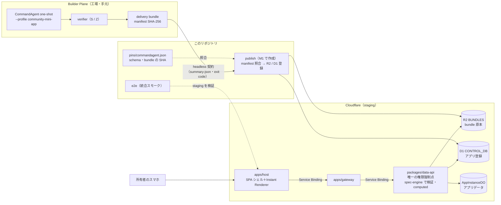

# M1：垂直スライス「工場→店頭」 — 概要

> 出典：企画書 v3.2 の 8章（表現力ラダー）／9章（アーキテクチャ）／12章（Builder Plane）／13章（テンプレート契約）／21章（リポジトリ構成）／22章（ロードマップ M1）。
> 企画書は非公開リポジトリ `Kewton/Musunest-workspace` の `proposal/` にある。**ここには章番号だけを書き、内容を引き写さない。**
> 状態：**未着手**（2026-09-15 時点。M0 は 2026-09-15 にクローズ）。本書は Issue を切り出す前の整理であり、手順書ではない。
> 着手前に所有者が決めることは [`00-open-questions.md`](./00-open-questions.md) にまとめた。
>
> ⚠️ **進め方を見直した（2026-09-15）**：所有者の方針「まず手書きのサンプルアプリを Cloudflare で動かし、その後に CommandAgent を合わせて結合する」を受けて、
> 進め方を [`01-integration-strategy.md`](./01-integration-strategy.md) にまとめ、所有者が決めた（同 §6）。**M1 は M1a（見本 3 つをこのリポジトリで動かす）と M1b（CommandAgent と結合する）に分ける。**
> 見本 3 つ（割り勘・タスク管理・ダッシュボード）の宣言の具体例は [`02-l2-spec-examples.md`](./02-l2-spec-examples.md)、宣言の層構造と静的チェックの方向性は [`03-spec-layers-and-checker.md`](./03-spec-layers-and-checker.md) にある。
> **M1a と M1b のゲートは 2026-09-15 に宣言し直した（`01` §5.3）。§0 の表と §1 以降は、まだ「工場の golden を先に動かす」前提のままである。** 次に `00-open-questions.md` とあわせて M1a 向けに書き直す。

---

## 0. 一言でいうと

この節で言いたいこと：
CommandAgent（工場）が生成・検証した割り勘アプリを、MUSUNEST（店頭）が R2 から読み込み、staging のスマートフォンで実際に動かせる状態にする。

M0 では「空の店舗」を構築した。インフラの各層（host → gateway → data-api → D1 / R2 / DO）が 3 環境すべてで疎通した状態である。
M1 では、その店舗に**最初の商品を 1 つ並べる**。あわせて、工場と店頭の接点（headless 契約とピン）をプラットフォーム側から一通り疎通させる。
なお、ログイン・Community・招待・リアルタイム同期は M2 の担当であり、M1 では作らない（§6 参照）。

| マイルストーン | 動くもの | 主な利用者 | 工場との接点 |
|---|---|---|---|
| M0（完了） | `/healthz` の貫通スモーク | CI | ピンの記述のみ |
| **M1（これから）** | **封緘済み golden 割り勘が 1 つ動く** | 所有者のスマートフォン（ログインなし） | **ピンで読み込み、再検証まで回す** |
| M2 | 自分たちで作って共有し利用する（TTSU ≤ 10分） | 招待されたメンバー（ゲスト claim・Google OAuth） | Queue から自動生成を起動する（連携 Lv2） |

### 0.1 目指すユーザー体験（ユーザーシナリオ）

この節で言いたいこと：
**スマホの画面で「こんなアプリがほしい」と伝えると、数分でアプリができて、そのまま仲間と使える。** これが MUSUNEST の目指す体験である。M1 はその一部を作る（§0.2）。

登場人物は2人。

- **A さん**：友だち3人（A・B・C）の旅行の幹事。アプリを作る人
- **B さん**：旅行の参加者。A さんから届いたリンクでアプリを使う人

| # | 利用者がすること | 画面とシステムで起きること |
|---|---|---|
| 1 | A さんがスマホで MUSUNEST を開き、Google でログインする | ホーム画面に「アプリを作る」が出る |
| 2 | A さんが「旅行の割り勘アプリがほしい。誰が何を払ったかを入れて、最後に誰が誰へいくら払えばいいか見たい」と入力して送る | 指示が受け付けられ、工場（CommandAgent）が動き始める |
| 3 | A さんは待つ | 画面に進み具合が出る（読み取り中 → 作成中 → 検査中 → 公開中） |
| 4 | 数分後、「できました」と表示される。A さんがアプリを開く | 割り勘アプリの画面が出る。支出の一覧と「支出を追加」のボタンがある |
| 5 | A さんが「メンバーを招待」を押し、LINE で B さん・C さんにリンクを送る | 招待リンクができる（有効期限つき） |
| 6 | B さんが LINE でリンクを開き、「あなたは誰？」で自分の名前を選ぶ | ログインしなくても参加できる |
| 7 | 旅行中、A さんが「夕食 6,000 円（A・B・C）」、B さんが「タクシー 3,000 円（A・B・C）」を入力する | 入力はその場で検証されて保存される。他の人の画面にもすぐ出る |
| 8 | 旅行のあと、A さんが精算の画面を開く | 「C さん → A さんに 3,000 円」と表示される |
| 9 | A さんが「支出にメモ欄を足して」と追加で指示する | 数分後、同じリンクのままアプリが新しくなる。入力済みの支出はそのまま残る |

### 0.2 シナリオのどこを、いつ作るか

この節で言いたいこと：
M1 で作るのは、**アプリを置いて、画面を出して、入力を検証して保存する**ところ（手順 4・7・8 の中身）である。指示の GUI・自動の生成・共有・ログインは M2 で作る。

| 手順 | 必要な仕組み | いつ作るか |
|---|---|---|
| 1 | ログイン（Google OAuth） | M2 |
| 2〜3 | 指示を受け付ける GUI、工場の自動起動、進み具合の通知（連携 Lv2） | M2（M1a では手書きの見本を置く。M1b では開発者が手で工場を動かす） |
| 4 | 納品物を置いて登録する仕組み（publish）、宣言から画面を出す仕組み（Instant Renderer） | **M1a** |
| 5〜6 | 招待リンク、ゲスト参加（名前を選んで参加） | M2 |
| 7 | 入力の検証と保存（data-api・DO） | **M1a**（他の人の画面にすぐ出るリアルタイム同期は M2） |
| 8 | 精算（誰が誰へいくら） | **M1a**（見本に入れると決めた。v0.1 では書けないので、スキーマの新しい版で足す。`01-integration-strategy.md` の D4） |
| 9 | 追加の指示で作り直す仕組み、同じリンクのままの差し替え（Progressive Delivery） | M2 以降 |

- 「数分」の大半は、工場が宣言を作って検査する時間である。MVP のアプリはコードを持たない（L2）ので、店頭での「デプロイ」は R2 に置いて台帳に登録するだけで済む（`01-integration-strategy.md` §1.1）
- 手順 8 の例：夕食 6,000 円（A さんが払い、3 人で割る）とタクシー 3,000 円（B さんが払い、3 人で割る）なら、A さんは 3,000 円の受け取り、B さんは 0 円、C さんは 3,000 円の支払いになる

### 0.3 主要な用語

M1 で頻出する専門用語の意味を以下にまとめる。

| 用語 | 意味 |
|---|---|
| L2（Level 2） | 画面コードを持たず、データ構造と計算式の宣言（`app.spec.yaml`）だけで完結する仕様水準。具体例は [`02-l2-spec-examples.md`](./02-l2-spec-examples.md)。 |
| bundle（納品物） | 工場（CommandAgent）が生成・検証した成果物一式。R2 にそのまま配置する。 |
| manifest | bundle に含まれる全ファイルの SHA-256 ハッシュ値とファイルサイズを記録した一覧ファイル。 |
| golden | 回帰テスト用に封緘（固定）された標準の生成要求文、またはその生成結果。 |
| 封緘（ふうかん） | 成果物のハッシュ値（SHA-256）を固定し、以降の改ざんや勝手な変更を防ぐこと。 |
| ピン | 依存する外部成果物（スキーマや bundle など）の SHA-256 や版を `pins/` 配下で固定すること。 |
| headless 契約 | CommandAgent を CLI から呼び出し、JSON（`--summary-json`）と終了コードで結果を機械的に受け渡す規律。 |
| verdict / assurance | 工場の判定結果。verdict は最終の判定（`full` 等）、assurance は検証がどこまで保証しているか（`partial` 等）。 |
| computed | 登録されたフィールド値をもとに、定義された計算式から自動算出される値。 |
| Instant Renderer | spec を解釈し、一覧画面・入力フォーム・computed の表示をブラウザ上で動的に生成する画面。 |
| Service Binding | Cloudflare Workers 同士がインターネットを経由せず、安全かつ高速に直接通信する仕組み。 |
| Durable Object（DO） | Cloudflare が提供する、個別のストレージ（SQLite）を持つステートフルな実行環境。 |

---

## 1. ゴール

この節で言いたいこと：
封緘済み golden 割り勘アプリを staging のスマートフォンで動かし、工場（CommandAgent）との接点を確立する。

### 1.1 完了条件

企画書 22 章の M1 定義を、本リポジトリの言葉に置き換えた完了条件である。

| # | 項目 | 完了条件 |
|---|---|---|
| M1-1 | ミニアプリの配信 | R2 に配置した納品物（bundle）を host が実行時に読み込み、データが Durable Object に保存される。**封緘済み golden 割り勘が staging のスマホで動く**。 |
| M1-2 | CommandAgent 連携 Lv1 | ① headless 契約で工場の結果を読み取れる。<br>② ピン差し替えの儀式を 1 回行う。<br>③ one-shot 生成 → R2 → スマホ確認までを一気通貫で通す。<br>④ 納品物の決定的な再検証をプラットフォーム側から再現する。 |

### 1.2 ゲート（2026-09-15 事前宣言済み・`../m0/05-acceptance.md` §7）

> ⚠️ **この宣言は、同じ日に M1a と M1b に分けて宣言し直した**（[`01-integration-strategy.md`](./01-integration-strategy.md) §5.3）。下は元の宣言で、M1b のゲートに含まれる。

この節で言いたいこと：
合否判定は「封緘済み golden 割り勘が staging のスマホで動く」ことである。判定者は Kewton、期限は M1 着手から 2 週間（着手日は未定）である。

判定方法は以下の 5 項目である。

1. 手持ちのスマートフォン 1 台で staging の URL を開く（OS とブラウザを記録する）。
2. 封緘済み golden の割り勘アプリを起動する。
3. golden のシナリオどおりに入力し、**結果が golden の期待値と一致する**ことを確かめる。
4. 再読み込みしても、別の端末で開いても、データが保持されている（DO に保存されている）ことを確かめる。
5. 配布した bundle の SHA-256 が `pins/` の値と一致することを、機械（smoke または e2e）で検証する。

> ⚠️ **項目 3 の「期待値」はまだ定義されていない**（§2.3 参照）。着手前に決定する（[`00-open-questions.md`](./00-open-questions.md) の Q2）。

---

## 2. 何を動かすのか：封緘済み golden 割り勘の実体

この節で言いたいこと：
動かす対象は、CommandAgent で封緘済みの L2 割り勘アプリである。支出 1 件ごとの計算のみを行い、複数支出にまたがる精算機能は含まない。

### 2.1 納品物（bundle）

CommandAgent（`pins/commandagent.json` の revision `031ec74`。2026-09-15 時点の main と一致）には、割り勘の **L2 納品物が 1 つ、R2 配置用の形式のまま封緘されている**。

| 項目 | 値 |
|---|---|
| 配置場所 | `workspace/management/runs/cm4-delivery-bundle-001/bundle/`（CommandAgent 側） |
| 形式 | `commandagent.community-delivery-bundle/v1` |
| 由来 | 封緘済みスイート `community-golden-warikan`（要求文 3 種。`community-golden.sha256sums` で封緘）から 1 回の生成（修復 0 回） |
| 成果物の水準 | **L2**（`app.spec.yaml` のみ。画面コード `app-zone/` は含まない） |
| 検証結果 | S（spec）pass、Z（境界）pass（B は L2 のため対象外）。再検証 2 回で同一バイト・同一 verdict |
| headless 判定 | `verdict: full`、**`assurance: partial`** |
| スキーマ | `community.app-spec/v0.1`（SHA-256 は `pins/commandagent.json` の `appspec_schema.sha256` と一致: `80e4cb41…`） |
| manifest SHA-256 | `9e0865ea86a35070d7f3e6b87d615aaf2ac6c9f80aec7cb5958b2c6ed8eefdb8` |

- `bundle-manifest.json` は、11 ファイルの SHA-256 とファイルサイズを記録している。
- `assurance: partial` は隠し事ではなく、CommandAgent の契約に基づく正規のラベルである。
- L2 における「full」は、「spec の検証は完了した。実行時のスモークはプラットフォーム統合側が受け持つ」という意味である。工場側では画面を動かしていない。
- **M1 は、この「プラットフォーム統合側の被覆」を実装する**マイルストーンである。

### 2.2 アプリの中身（`artifacts/app.spec.yaml`）

この節で言いたいこと：
支出を 1 件ずつ登録し、1 件ごとに「1 人あたりの支払額」「立て替えた人の受取額」を算出する仕様である。

```yaml
entities:
  - name: expense
    fields: { amount: number, payer: string, participants: list, description: string }
views:       [{ name: expenseList, entity: expense }]
actions:     [{ name: addExpense, entity: expense }]
validations: [{ name: positiveAmount, entity: expense, expression: amount > 0 }]
computed:
  - { name: shareAmount,      entity: expense, expression: amount / len(participants), type: number }
  - { name: netBalance,       entity: expense, expression: amount - shareAmount,       type: number }
  - { name: settlementAmount, entity: expense, expression: max(0, netBalance),         type: number }
permissions: [{ name: read, subject: minIdentity }]
minIdentity: { mode: anonymous }
```

（原本はブロック形式の YAML である。ここでは可読性のためフロー形式で掲載した。正本のバイト列は CommandAgent 側にある。）

### 2.3 スキーマ v0.1 で表現できること・できないこと

この節で言いたいこと：
スキーマ v0.1 は単一レコード内の計算に限定されており、複数支出をまたぐ全体精算（誰が誰へいくら）は表現できない。

v0.1 は 355 バイトと極めて小さい。computed は同一 entity 内のみを参照できる（`reference_scope: same_entity`）。全体参照は未解禁（QUEUED）であり、組み込み関数は `min`・`max`・`len` のみである。

| 表現できること | 表現できないこと（v0.1 の制限） |
|---|---|
| 支出 1 件ごとの 1 人あたり額・立て替え分 | 支出をまたぐ人ごとの合計収支 |
| 単一入力の検証（`amount > 0`） | 「誰が誰へいくら渡すか」の全体精算 |
| 一覧の表示・支出の追加 | メンバー entity や entity 間のリレーション |

企画書 8 章の割り勘（全体収支から精算を導く形式）は、**封緘済みの v0.1 では表現できない**。golden の生成も v0.1 の範囲内に留まる。
したがって、ゲート判定 3 の「golden の期待値」を全体精算と解釈すると、M1 では満たせない。
スキーマ拡張（v0.2）と golden の再封緘には工場側の裁定が必要であり、M1 の 2 週間には収まらない（[`00-open-questions.md`](./00-open-questions.md) の Q2 参照）。

### 2.4 v0.1 が決めていない「実行時の意味」

この節で言いたいこと：
スキーマは構文を定義しているが、実行時の具体的な解釈は未定義である。この解釈はプラットフォーム側（MUSUNEST）が決定する。

スキーマは MUSUNEST が正本を持つ（platform-owned）。そのため、スキーマのバイト列は変更せず、実行時の意味のみを M1 で規定する。

| 宣言項目 | スキーマで決めていないこと | 未定事項の具体例 |
|---|---|---|
| `fields` | `list` の要素型・入力形式 | `participants` は文字列リストか。支払者自身を含めるか。 |
| `views` | 表示レイアウト・種類 | `expenseList` の一覧形式。computed の表示位置。 |
| `actions` | 処理の具体的内容 | `addExpense` は 1 件追加のみを指すか。 |
| `permissions` / `minIdentity` | `subject: minIdentity`・`mode: anonymous` の強制方法 | M1 は未認証のため誰でも読み書き可能な状態となる（§7.3 参照）。 |

---

## 3. 全体像

この節で言いたいこと：
手元で bundle を検証して R2 / D1 へ登録し、Cloudflare 上の Worker 群を経由してスマートフォンの画面へ届ける。



### 3.1 リクエストの流れ（M1 で通す道）

リクエスト処理は以下の 5 段階で進む。

1. **配る（配布）**：
   - 手元の `publish` スクリプトを実行する。
   - bundle の manifest（全ファイルの SHA-256・余分なファイルが無いこと）と `pins/` を照合する。
   - 照合完了後、R2 に原本を配置し、D1 にアプリ（bundle の SHA）とインスタンスを登録する。
2. **開く（閲覧）**：
   - スマートフォンから host の `/apps/<インスタンス>` を開く。
   - SPA シェル（Static Assets）から画面が返る。**SSR は行わない**。
3. **読む（取得）**：
   - 画面が `/api/...` を呼び出す。
   - host の Worker が gateway へ中継し、data-api が D1 の登録情報をもとに R2 の spec を引いて返す。
   - host および gateway は R2 に直接触れない。
4. **書く（登録・計算）**：
   - 「支出を追加」する際、data-api が spec の `validations` に基づいて入力を検証し、DO に保存する。
   - computed は data-api が `spec-engine` を使って評価し、結果を画面に返す。
5. **残る（永続化）**：
   - 画面の再読み込みや別端末からのアクセスでも、同一インスタンスの DO から同じデータが返る。

---

## 4. M0 から引き継ぐもの・M1 で足すもの

この節で言いたいこと：
M0 の疎通基盤の上に、spec の解釈・評価・UI 生成・永続化の各コンポーネントを実装する。

| 対象領域 | M0 の状態 | M1 で要るもの |
|---|---|---|
| `packages/appspec-schema` | バージョン定数のみ（`APPSPEC_SCHEMA_VERSION = "0.0.0-m0"`） | v0.1 スキーマ正本（SHA 一致）、型定義、実行時の意味の定義 |
| `packages/spec-engine` | 未実装 | computed 式の評価（閉じた式・AST の深さ 12・ノード 64・同一 entity 内・トポロジカル順）、validations の評価。**評価の前に静的検査を行う** |
| `packages/app-do` | healthz 用の `kv` 表のみ | entity レコード保持用の表、1 インスタンス 1 DO（クラス名 `AppInstanceDO` は変えない） |
| `packages/control-plane` | メタ表（`_musunest_meta`）のみ | アプリ（bundle）とインスタンス登録用の D1 マイグレーション（前方互換の規律どおり） |
| `packages/data-api` | `/healthz` のみ | spec 取得（R2 から読む）、レコード一覧・追加（検証つき）、computed 評価の各 API |
| `apps/gateway` | `/healthz` の中継のみ | `/api/...` の中継（M1 は認可なし。M2 で AppGrant 検査を追加） |
| `apps/host` | `/api/*` は 404 応答 | `/api/*` の中継、**Instant Renderer**（画面生成機能） |
| `packages/sdk` | 未実装 | host から data-api を呼び出す型付きクライアント |
| `e2e` | 未実装 | Form A 統合スモーク（publish → 作成 → 追加 → 計算・永続化照合） |
| `pins/commandagent.json` | スキーマ・headless の版は確定。テンプレの tarball は null（#38） | golden bundle のピン（manifest の SHA-256） |
| `templates/tanstack-start` | README のみ | L2 の golden には使わない。扱いは Q4 で決める |
| `infra/scripts` | deploy・smoke・計測 | publish スクリプト、再検証の再現スクリプト（§5 ④） |
| 計測 | health chain の CPU 時間 | staging での spec 読み込みと computed 評価の CPU 時間実測 |

- **依存の向き**：`infra/scripts/dep-graph.mjs` を変えずに実装できる。data-api は `appspec-schema`・`sdk`・`spec-engine`・`app-do` を参照できる。host は `sdk` のみを参照する。
- **computed の評価場所**：画面側で評価すると host → spec-engine の依存が必要になり、人による dep-graph の変更が発生する。そのため、**M1 ではサーバ側（data-api）で評価する**。
- **CPU 時間の実測**：`../m0/06-plan-and-limits.md` §4.1 からの持ち越し課題である。staging 環境で実測を行う。

---

## 5. CommandAgent 連携 Lv1 を具体的にすると

この節で言いたいこと：
CommandAgent のコードは直接取り込まず、headless 契約（JSON 出力）とピン（ハッシュ固定）の 2 点のみで疎通する。

| # | 項目 | 本リポジトリで行うこと | 工場側・人の作業 |
|---|---|---|---|
| ① | headless 契約の疎通 | `--summary-json` の最終行（`commandagent.headless-summary/v1`）を読む薄い部品を実装する。 | 手元で CommandAgent を動かす（API キー等は手元に保持）。 |
| ② | ピン差し替えの儀式（1回） | runbook を作り、実施する（新旧のピンを並べて照合 → 回帰（再検証・e2e）→ 旧ピンを外す → 1 コミットで記録）。 | 差し替えるピンの選定と承認を行う（Q9 参照）。 |
| ③ | one-shot 生成の導通確認 | 生成された bundle を staging に publish し、スマホで開く。 | 要求文を入力して one-shot 生成を 1 回実行する。 |
| ④ | 決定的な再検証の再現 | TypeScript で manifest を照合し、ピンした版の CommandAgent の offline verifier を呼ぶ。結果が bundle の `reverification.json` と一致することを確かめる。 | 手元または CI での実行環境を判断・確認する（Q8 参照）。 |

- **判定基準**：① の headless 契約では、終了コードだけで合否を決めない。必ず `verdict` と `assurance` の両方を確認する。
- **生成物の位置づけ**：③ で新しく生成した成果物は、封緘済み golden（§2 参照）とは別物である。ゲート判定は**封緘済みの golden**で行い、③ は「工場から店頭まで通った」証拠として扱う（Q1 参照）。

---

## 6. M1 で作らないもの

この節で言いたいこと：
M1 は「店頭に最初の商品を 1 つ並べる」ことに専念し、認証・リアルタイム同期・完全自動化は見送る。

| 作らないもの | 理由・対応予定 |
|---|---|
| ログイン（Google OAuth）、ゲスト claim、Community、招待リンク、AppGrant 認可 | M2 で実装する。 |
| リアルタイム同期（DO の WebSocket 接続） | M2 で実装する（M1 は再読み込みでデータが残れば足りる）。 |
| Queue による自動生成、修復枯渇時の昇格（連携 Lv2）、Progressive Delivery | M2 で実装する。 |
| TTSU ファネル計測、帰属分類ログなどの計測基盤 | M2 で実装する。 |
| L3（server functions / WfP）、L4（sandboxed iframe UI） | L3 は M5〜M6 まで使わない（`../m0/06-plan-and-limits.md` §3）。L4 は必要時に検討する。 |
| 全体精算（誰が誰へいくら）、全体参照の computed、精算の標準関数 | スキーマ v0.2 と golden 再封緘の後（工場側の裁定が必要）。 |
| production 環境でのミニアプリ公開 | M2 以降（認証機能の導入後。Q5 参照）。 |

---

## 7. 守る制約

この節で言いたいこと：
開発規律（CLAUDE.md）、無償枠の制限、未認証状態における運用の規約を厳守する。

### 7.1 不変条件（`CLAUDE.md`）

- **Data API が唯一の権限強制点である**：入力検証（validations）、computed の評価、データ保存はすべて data-api で行う。画面側の検証は補助にすぎない。
- **直接アクセスの禁止**：host および gateway から D1・R2・DO に直接触れない。bundle も data-api 経由で取得する。
- **ストレージの分離**：D1 は Control Plane 専用（アプリ・インスタンス管理）とする。**アプリのデータはすべて DO に保存する**。
- **リポジトリ境界の維持**：CommandAgent のコードを持ち込まない。接点は headless 契約と `pins/` のみとする。
- **環境制約の遵守**：host は SSR にしない。Workers for Platforms、Logpush、`schedule:` トリガーは使用しない。

### 7.2 無償枠（`../m0/06-plan-and-limits.md`）

- **CPU 時間の上限は 1 起動あたり 10 ms である**：
  - 毎回 YAML をパースして静的検査を行うと、10 ms を超えるリスクがある。
  - publish 時に正規化済みの形式を作っておく、評価済みの形を DO に持つ、などの対策を実測に基づいて決める（Q12 参照）。
- **昇格トリガーへの対応**：
  - M0 の実測では production 初回実行時に 11.30 ms を記録している。
  - M1 の追加機能によって昇格トリガー（P-1）に触れた場合は、構成を崩さずに即座に有償プラン（$5）へ昇格する。

### 7.3 ログインが無いこと

- M1 のアプリは誰でも読み書き可能な状態である（`minIdentity.mode: anonymous` をそのまま適用）。
- staging の URL は非公開のサブドメインだが、秘密情報ではない。
- **この認証なしの状態のまま production 環境へ公開してはならない**（Q5 参照）。

### 7.4 公開リポジトリ

- 企画書を参照する際は、内容を引き写さず章番号のみを記載する。
- golden の bundle と CommandAgent のドキュメントは公開リポジトリにあるため、パスや SHA-256 を記載してよい。
- 工場側の API キー、ローカルモデルの設定、生成費用の明細などは本リポジトリに置かない。

---

## 8. リスク

この節で言いたいこと：
技術仕様・工数・規律に関する 7 つのリスク（R-1〜R-7）を把握し、事前の対策を講じる。

| # | リスク | 発生時の影響 | 事前・事後の手当て |
|---|---|---|---|
| R-1 | v0.1 の表現力がゲートの精算要件に届かない（§2.3） | 判定 3 を満たせず、期限直前に合格基準が紛糾する。 | **着手前に期待値を事前宣言し直す**（Q2 参照）。 |
| R-2 | v0.1 の実行時の意味が工場の verifier とずれる（§2.4） | 仕様検証を通った生成物が、画面で意図どおりに動かない。 | 実行時の意味を appspec-schema に明記する。ずれを発見した場合は工場側へ裁定を依頼する（スキーマのバイト列は変えない）。 |
| R-3 | 処理時間が CPU 10 ms の上限を超える（§7.2） | staging で動いても production の昇格トリガーに触れる。 | M1 内で CPU 時間を実測する。超過時は即座に $5 プランへ昇格する方針を事前に決めておく。 |
| R-4 | 認証なしの API が production に露出する（§7.3） | 誰でも production の DO にデータを書き込めてしまう。 | 環境変数で無効化（production では 404 を返却）するか、M1 期間中はリリースタグを打たない。 |
| R-5 | one-shot 生成（③）が所有者の手元環境に依存する | 結果を再現できず、生成費用が見えない。 | 生成は疎通の証拠づくりに留め、ゲート判定は封緘済みの golden で行う。 |
| R-6 | 2 週間の期限に対して部品数が多い（§4） | 開発期間内に完了しない。 | 最短経路（golden の手動 publish → 画面表示 → 保存）を最優先で開通させ、Lv1 の ②④ は並行して進める。 |
| R-7 | orchestrate の実行契約上限（ソース約 30 本・`.tf` 変更不可）に抵触する | 大きすぎる Issue を自動 dispatch できない。 | §10 の方針に従い、適切な粒度に Issue を分割する。 |

---

## 9. 人の作業（🧑）

この節で言いたいこと：
着手前・実装中・検収時の各段階で、所有者本人が行う判断および作業を明確にする。

| タイミング | 作業内容 |
|---|---|
| 着手前 | `00-open-questions.md` の全項目を決定する。<br>**M1 の着手日を決定し、`../m0/05-acceptance.md` §7 に記入する**（ゲートの期限が確定する）。 |
| 実装中 | CommandAgent で one-shot 生成を 1 回実行し、bundle を作成する（③）。<br>ピン差し替えの儀式を承認する（②）。 |
| 実装中（必要時） | 手元で再検証を実行する（④）。<br>production への反映を承認する（M1 の範囲で対象がある場合）。 |
| 検収時（最後） | 実機のスマートフォンでゲート判定 1〜4 を実施し、結果を記録する。<br>清算表を記入する。 |

---

## 10. Issue の切り出し方針（概略）

この節で言いたいこと：
Issue は 1 パッケージ前後・ソース 30 本程度までの単位で分割し、土台・経路・画面・証拠の順で実装を進める。

- **分割の基準**：
  - 1 Issue あたり 1 パッケージ前後、ソースコード 30 本程度を上限とする（orchestrate の実行契約制約）。
  - `.tf` を含む変更は監督側（人と Claude）が担当する（orchestrate の scope に載らないため）。
- **実装順序（波）**：
  1. **波 1：土台（並列作業可）**：
     - `appspec-schema`：スキーマ正本、型定義、実行時の意味の定義
     - `spec-engine`：式評価および静的検査
     - `app-do`：レコード保持用のテーブル設計
     - `control-plane`：登録用 D1 マイグレーション
  2. **波 2：経路**：
     - `data-api`：spec 取得、レコード一覧・追加、computed 評価の各 API
     - `gateway` / `host`：API 中継処理
  3. **波 3：画面**：
     - `host`：Instant Renderer（画面生成機能）
     - `sdk`：型付きクライアント
  4. **波 4：証拠**：
     - `publish` スクリプトの作成
     - golden のピン定義
     - e2e テストの実装（ゲート判定 5）
     - CPU 時間の実測
  - **並行レーン（波 1 と並走）**：
    - Lv1 連携：headless 契約の読み取り、再検証の再現、ピン差し替え runbook の整備
- **既存の M1 関連 Issue**：
  - #38（テンプレート tarball の SHA）：Q4 の決定に基づき扱いを確定する。
  - #19（商標調査の発注）：技術的な開発作業とは独立して進める。

---

## 11. 次の一手

この節で言いたいこと：
所有者の判断を受けて Issue を起票し、着手日を決めて M1 の開発に入る。

1. 所有者が [`00-open-questions.md`](./00-open-questions.md) の全問に回答する（おすすめの採用でよければその旨を合意する）。
2. 回答結果を受けて、依存関係と波を整理した Issue 一覧を作成し、起票する。
3. M1 の着手日を確定し、受入ゲートの完了期限を確定させる。
